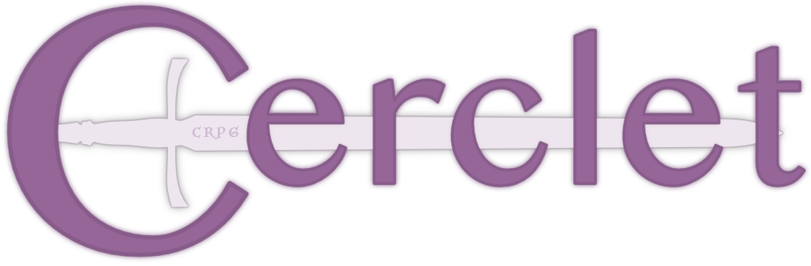

  

Cerclet is a role-playing game (RPG) rules engine using Open Game Content.

## Getting Started

Code and build instructions to follow...

## Links

-   [CMake](https://cmake.org) - Cross-platform build tool
-   [Catch2](https://github.com/catchorg/Catch2) - Unit test framework

## License

- Cerclet source code is distributed under the Apache License 2.0 License - see the [LICENSE](LICENSE) file for details.
- [Open Game Content](OpenGameContent.md) used by this project is licensed under the [OGL 1.0a](OGL.md).
